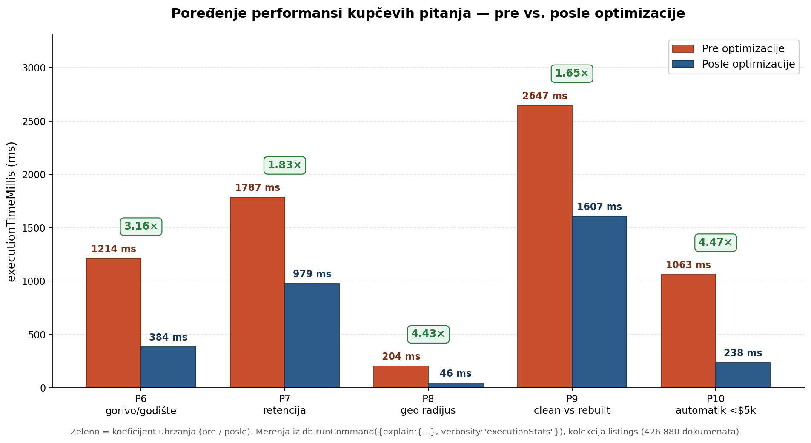

# Kupčeva pitanja — implementacija, indeksi i analiza performansi

Ovaj dokument prati pet pitanja iz uloge **kupca** (pitanja 6–10 iz [`README.md`](./README.md)). Za svako pitanje prikazana je obična i optimizovana verzija queri-ja, indeks koji queri koristi, i tabela metrika iz `explain executionStats` pre i posle optimizacije.

---


## Metodologija merenja performansi

- Baza radi u Docker kontejneru **`craigslist-mongodb`**, kolekcija `listings` sadrži 426.880 dokumenata.
- Sva merenja rađena su preko `db.runCommand({ explain: { aggregate: "listings", pipeline: [...] , cursor: {} }, verbosity: "executionStats" })`. Šablon je u [`console_6.js`](./console_6.js).
- Kada je bilo potrebno merenje bez optimizacije, indeks je privremeno izostavljen ili je queri pušten sa `hint` koji tera COLLSCAN. Kada je merena optimizovana verzija, koristi se odgovarajući kompozitni indeks (i opcioni `hint`).
- Ključne metrike koje se prate:
  - **`executionTimeMillis`** — ukupno vreme izvršavanja plana
  - **`totalKeysExamined`** — broj pregledanih ključeva u indeksu
  - **`totalDocsExamined`** — broj dokumenata koje je engine morao da pročita sa diska
  - **`winningPlan.stage`** — strategija (`COLLSCAN`, `IXSCAN`, `FETCH`, `IDHACK`, `SORT`, ...)
  - **`indexName`** — ime korišćenog indeksa
  - **Covered query** — kada je `totalDocsExamined = 0`, svi neophodni podaci su pročitani iz indeksa; ovo je optimum jer se izbegava odlazak na disk po dokumente.
- Napomena: sva merenja obavljena su u istoj sesiji (topao kesh), tako da su ubrzanja *pre → posle* uporediva.
- Pravilo pri projektovanju kompozitnog indeksa: **ESR (Equality → Sort → Range)**. Prvo idu polja sa egzaktnim poklapanjem, zatim polja po kojima se sortira, na kraju range polja (`$gt`, `$lt`, ...).

---

## Pitanje 6 — Cena po tipu goriva (2016–2021)

**Formulacija:** Kako se prosečna i medijalna cena razlikuje po tipu goriva (benzin, dizel, hibrid, EV) kroz poslednjih 6 godišta (2016–2021)?

Uz glavni queri, priložen je i "pomagalo" queri koji izračunava koliko je oglasa u kolekciji sa cenom nižom od $200 (opravdanje za `price >= 200` filter u glavnom queriju).

### Obični queri (pre optimizacije)

```javascript
db.listings.aggregate([
    {
        $match: {
            'specs.fuel': { $ne: null },
            'price': { $gte: 200 },
            'vehicle.year': { $gte: 2016, $lte: 2021 },
            'specs.fuel': { $in: ['gas', 'hybrid', 'diesel', 'electric'] }
        }
    },
    {
        $group: {
            '_id': {
                'fuel_type': '$specs.fuel',
                'manufacturing_year': '$vehicle.year'
            },
            'avg_price': { $avg: '$price' },
            'mean_price': { $median: { input: '$price', method: 'approximate' } },
            'sum': { $sum: 1 },
            'min_price': { $min: '$price' },
            'max_price': { $max: '$price' }
        }
    },
    {
        $project: {
            '_id': 0,
            'Fuel Type': '$_id.fuel_type',
            'Manufacturing Year': '$_id.manufacturing_year',
            'Average Price': { $round: ['$avg_price', 2] },
            'Mean Price': { $round: ['$mean_price', 2] },
            'Semples': '$sum',
            'min_price': { $round: ['$min_price', 2] },
            'max_price': { $round: ['$max_price', 2] }
        }
    },
    { $sort: { 'Fuel Type': 1, 'Manufacturing Year': 1 } }
])
```

**Explain (bez indeksa):**

| Metrika | Vrednost |
|---|---|
| Strategija | **COLLSCAN** |
| `executionTimeMillis` | **1214 ms** |
| `totalKeysExamined` | 0 |
| `totalDocsExamined` | 426.880 |
| `nReturned` | 115.261 |

### Optimizacija — kompozitni indeks

Redosled polja prati **ESR** pravilo: `specs.fuel` (equality preko `$in`) → `vehicle.year` (range) → `price` (range/projekcija). Ovim se COLLSCAN nad 426.880 dokumenata zamenjuje **covered IXSCAN**-om.

```javascript
db.listings.createIndex({
    'specs.fuel': 1,
    'vehicle.year': 1,
    'price': 1
})
```

### Optimizovani queri

```javascript
db.listings.aggregate(
    [ /* isti pipeline */ ],
    {
        hint: {
            'specs.fuel': 1,
            'vehicle.year': 1,
            'price': 1
        }
    }
)
```

**Explain (sa indeksom):**

| Metrika | Vrednost |
|---|---|
| Strategija | **IXSCAN** (covered) |
| Indeks | `specs.fuel_1_vehicle.year_1_price_1` |
| `executionTimeMillis` | **384 ms** |
| `totalKeysExamined` | 115.288 |
| `totalDocsExamined` | **0** (covered) |
| `nReturned` | 115.261 |

### Analiza / bottleneck

Ubrzanje **~3.16×**. Bottleneck pre optimizacije: sekvencijalno skeniranje svih 426.880 dokumenata, iako queri vraća samo 115.261 (27% kolekcije). Posle optimizacije plan je **covered** — `totalDocsExamined = 0` znači da se `avg`, `median`, `sum`, `min`, `max` računaju direktno iz vrednosti smeštenih u indeksu, bez odlaska na disk po dokumente.

---

## Pitanje 7 — Top 10 modela sa najboljom retencijom vrednosti

**Formulacija:** Kojih top 10 modela najbolje zadržava vrednost — koji imaju najniži godišnji deprecijacioni gubitak?

Queri se oslanja na medijalne cene po (model, godište), pa računa geometrijsku prosečnu godišnju retenciju kao `(oldest_price / newest_price) ^ (1 / age_span)`. Modeli sa retencijom između 0.5 i 1.0 (razumno realni) sortiraju se opadajuće; uzima se prvih 10.

### Obični queri (pre optimizacije)

```javascript
db.listings.aggregate([
    {
        $match: {
            'price': { $ne: null, $gt: 2000 },
            'vehicle.model': { $ne: null },
            'vehicle.year': { $gte: 2008, $lte: 2021 },
            'specs.title_status': { $eq: 'clean' }
        }
    },
    {
        $group: {
            '_id': { 'model': '$vehicle.model', 'manufacturing_year': '$vehicle.year' },
            'median_price': { $median: { input: '$price', method: 'approximate' } },
            'num_listings': { $sum: 1 }
        }
    },
    { $match: { 'num_listings': { $gte: 5 } } },
    { $set: { 'age': { $subtract: [2021, '$_id.manufacturing_year'] } } },
    { $sort: { '_id.model': 1, 'age': 1 } },
    {
        $group: {
            '_id': '$_id.model',
            'newest_price': { $first: '$median_price' },
            'oldest_price': { $last: '$median_price' },
            'newest_age': { $first: '$age' },
            'oldest_age': { $last: '$age' },
            'years_covered': { $sum: 1 }
        }
    },
    { $match: { 'years_covered': { $gte: 5 } } },
    { $set: { 'age_span': { $subtract: ['$oldest_age', '$newest_age'] } } },
    { $match: { 'age_span': { $gt: 0 } } },
    {
        $set: {
            'annual_retention': {
                $pow: [
                    { $divide: ['$oldest_price', '$newest_price'] },
                    { $divide: [1, '$age_span'] }
                ]
            }
        }
    },
    {
        $set: {
            'annual_loss_perc': { $round: [ { $multiply: [ { $subtract: [1, '$annual_retention'] }, 100 ] }, 1 ] },
            'annual_retention_perc': { $round: [ { $multiply: ['$annual_retention', 100] }, 1 ] }
        }
    },
    { $match: { 'annual_retention': { $gt: 0.5, $lt: 1 } } },
    { $sort: { 'annual_retention': -1 } },
    { $limit: 10 },
    {
        $project: {
            '_id': 0,
            'model': '$_id',
            'Newest Price': '$newest_price',
            'Oldest Price': '$oldest_price',
            'Age Span': '$age_span',
            'Years Covered': '$years_covered',
            'Retetnion Percentage': '$annual_retention_perc',
            'Loss Percentage': '$annual_loss_perc'
        }
    }
])
```

**Explain (bez indeksa):**

| Metrika | Vrednost |
|---|---|
| Strategija | **COLLSCAN** |
| `executionTimeMillis` | **1787 ms** |
| `totalKeysExamined` | 0 |
| `totalDocsExamined` | 426.880 |
| `nReturned` (posle `$match`) | 273.641 |

### Optimizacija — kompozitni indeks

`specs.title_status` je equality na jednu vrednost (`'clean'`), `vehicle.year` je range, `price` je range. `vehicle.model` je dodat kao poslednji da bi indeks pokrio i grupisanje po modelu bez odlaska po dokumente.

```javascript
db.listings.createIndex({
    'specs.title_status': 1,
    'vehicle.year': 1,
    'price': 1,
    'vehicle.model': 1
})
```

**Explain (sa indeksom):**

| Metrika | Vrednost |
|---|---|
| Strategija | **IXSCAN** (covered) |
| Indeks | `specs.title_status_1_vehicle.year_1_price_1_vehicle.model_1` |
| `executionTimeMillis` | **979 ms** |
| `totalKeysExamined` | 274.434 |
| `totalDocsExamined` | **0** (covered) |
| `nReturned` (posle `$match`) | 273.641 |

### Analiza / bottleneck

Ubrzanje **~1.83×**. Plan je covered. Ubrzanje je skromnije jer je queri sam po sebi *compute-heavy* — dominira agregatni deo (dva `$group`-a, `$pow`, sortiranja) koji se ne može ubrzati indeksom. Ono što indeks jeste uklonio je početno skeniranje 426.880 dokumenata i deserialization kost prilikom čitanja polja `$vehicle.model` i `$price` — sada se ta polja izvlače direktno iz ključa indeksa.

---

## Pitanje 8 — Top 10 vozila u radijusu 100 mi

**Formulacija:** U radijusu od 100 milja od moje lokacije (primer: New York, `-74.0060, 40.7128`), kojih top 10 vozila u dobrom stanju, cene između $5.000 i $10.000 i sa manje od 100k milja na odometru je najpovoljnije, prikazano zajedno sa udaljenošću?

Queri koristi `$geoNear` (koji zahteva `2dsphere` indeks) i sortiranje po *condition rank*-u (custom mapping stanja u broj), pa po ceni i kilometraži.

### Obični queri (pre optimizacije)

Bazni `2dsphere` indeks je uvek obavezan za `$geoNear` (bez njega queri padne). Merimo situaciju kada postoji samo taj indeks:

```javascript
db.listings.createIndex({ 'location.geo': '2dsphere' })

db.listings.aggregate([
    {
        $geoNear: {
            near: { type: "Point", coordinates: [-74.0060, 40.7128] },
            distanceField: "distance_m",
            maxDistance: 160934,
            spherical: true,
            query: {
                'price': { $gt: 5000, $lt: 10000 },
                'specs.odometer_miles': { $ne: null, $lt: 100000 },
                'specs.condition': { $in: ['excellent', 'new', 'like new', 'good'] }
            }
        }
    },
    {
        $set: {
            condition_rank: {
                $switch: {
                    branches: [
                        { case: { $eq: ['$specs.condition', 'new'] },       then: 2 },
                        { case: { $eq: ['$specs.condition', 'like new'] },  then: 4 },
                        { case: { $eq: ['$specs.condition', 'excellent'] }, then: 1 },
                        { case: { $eq: ['$specs.condition', 'good'] },       then: 3 },
                        { case: { $eq: ['$specs.condition', 'fair'] },       then: 5 },
                        { case: { $eq: ['$specs.condition', 'salvage'] },    then: 6 }
                    ],
                    default: 99
                }
            }
        }
    },
    {
        $project: {
            '_id': 0,
            'Model': '$vehicle.model',
            'Manufacturer': '$vehicle.manufacturer_ref',
            'Year': '$vehicle.year',
            'Price': '$price',
            'Condition': '$specs.condition',
            'Odometer': '$specs.odometer_miles',
            'State': '$location.state',
            'Region': '$location.region_ref',
            'Distance': { $round: [{ $divide: ['$distance_m', 1609.34] }, 1] },
            'Condition Rank': '$condition_rank'
        }
    },
    { $sort: { 'Condition Rank': 1, 'Price': 1, 'Odometer': 1 } },
    { $limit: 10 }
])
```

**Explain (samo `2dsphere`):**

| Metrika | Vrednost |
|---|---|
| Strategija | **IXSCAN** |
| Indeks | `location.geo_2dsphere` |
| `executionTimeMillis` | **204 ms** |
| `totalKeysExamined` | 31.023 |
| `totalDocsExamined` | 56.851 |
| `nReturned` | 1.219 |

### Optimizacija — kompozitni `2dsphere` + `price`

MongoDB podržava kompozitne indekse gde je geografsko polje kombinovano sa ne-geo poljem. Dodavanjem `price` u indeks, filter `price ∈ (5000, 10000)` primenjuje se već tokom skeniranja indeksa, umesto na dokumentima nakon fetch-a.

```javascript
db.listings.createIndex({
    'location.geo': '2dsphere',
    'price': 1
})
```

**Explain (sa kompozitnim indeksom):**

| Metrika | Vrednost |
|---|---|
| Strategija | **IXSCAN** |
| Indeks | `location.geo_2dsphere_price_1` |
| `executionTimeMillis` | **46 ms** |
| `totalKeysExamined` | 10.744 |
| `totalDocsExamined` | 12.679 |
| `nReturned` | 1.219 |

### Analiza / bottleneck

Ubrzanje **~4.43×**. Pre optimizacije usko grlo je bio *post-filter po ceni na dokumentima* — engine je morao da pročita 56.851 dokumenata koji leže u geo radijusu, pa da ih sortira po ceni i odbaci one van intervala. Sa kompozitnim indeksom filtracija po ceni se dešava direktno na indeksnim ključevima, pa `totalDocsExamined` pada sa 56.851 na 12.679, a `totalKeysExamined` sa 31.023 na 10.744.

Plan i dalje nije covered jer projekcija povlači polja koja nisu u indeksu (`vehicle.model`, `specs.condition`, `location.state`, ...), ali to je prihvatljivo jer je rezultat mali (`nReturned = 1219`).

---

## Pitanje 9 — "Clean" naspram "rebuilt" istog modela i godišta

**Formulacija:** Postoji li statistički značajna razlika između cena vozila sa "clean" i "rebuilt" stanjima za isti model i godište?

Ovo pitanje je jedini queri sa `$out` — rezultat se snima u kolekciju `pitanje_4_kupac_clean_vs_rebuilt`. Ovo je i najbogatiji primer za analizu, jer smo prošli kroz **tri faze**: (1) originalni queri bez indeksa, (2) restrukturiran queri bez indeksa (samo redizajn pipeline-a), (3) restrukturiran queri sa indeksom.

### Faza 1 — Originalni queri (bez indeksa)

Originalni queri koristi dva `$group`-a: prvi grupiše po (model, year, status) i računa medijalne cene, drugi po (model, year) i pravi niz sa `$push` gde svaki element sadrži status i statistike. Zatim se `$filter` + `$first` koriste za razdvajanje "clean" i "rebuilt" polja.

```javascript
db.listings.aggregate([
    {
        $match: {
            'specs.title_status': { $in: ['clean', 'rebuilt'] },
            'price': { $gte: 2000, $lte: 200000 },
            'vehicle.model': { $ne: null },
            'vehicle.year': { $ne: null, $lte: 2021 }
        }
    },
    {
        $group: {
            '_id': { 'model': '$vehicle.model', 'year': '$vehicle.year', 'status': '$specs.title_status' },
            'median_price': { $median: { input: '$price', method: 'approximate' } },
            'avg_price': { $avg: '$price' },
            'n': { $sum: 1 }
        }
    },
    {
        $group: {
            '_id': { 'model': '$_id.model', 'year': '$_id.year' },
            'stats': { $push: { 'status': '$_id.status', 'median': '$median_price', 'avg': '$avg_price', 'n': '$n' } }
        }
    },
    { $match: { 'stats.status': { $all: ['clean', 'rebuilt'] } } },
    {
        $set: {
            'clean':   { $first: { $filter: { input: '$stats', cond: { $eq: ['$$this.status', 'clean'] } } } },
            'rebuilt': { $first: { $filter: { input: '$stats', cond: { $eq: ['$$this.status', 'rebuilt'] } } } }
        }
    },
    {
        $set: {
            'diff_median': { $subtract: ['$clean.median', '$rebuilt.median'] },
            'rebuilt_discount_pct': {
                $round: [{ $multiply: [
                    { $divide: [ { $subtract: ['$clean.median', '$rebuilt.median'] }, '$clean.median' ] },
                    100
                ] }, 1]
            }
        }
    },
    { $match: { 'clean.n': { $gte: 5 }, 'rebuilt.n': { $gte: 5 } } },
    {
        $project: {
            '_id': 0,
            'Model': '$_id.model',
            'Year': '$_id.year',
            'Clean Median': '$clean.median',
            'Rebuilt Median': '$rebuilt.median',
            'Clean n': '$clean.n',
            'Rebuilt n': '$rebuilt.n',
            'Difference ($)': '$diff_median',
            'Rebuilt discount (%)': '$rebuilt_discount_pct'
        }
    },
    { $sort: { 'Rebuilt discount (%)': -1 } },
    { $out: "pitanje_4_kupac_clean_vs_rebuilt" }
])
```

**Explain (originalni queri, bez indeksa):**

| Metrika | Vrednost |
|---|---|
| Strategija | **COLLSCAN** |
| `executionTimeMillis` | **2647 ms** |
| `totalKeysExamined` | 0 |
| `totalDocsExamined` | 426.880 |
| `nReturned` (posle `$match`) | 357.007 |

### Faza 2 — Izmenjen queri (bez indeksa)

Umesto dva `$group`-a sa `$push` + `$filter`, restrukturisan je u **jedan** `$group` koji koristi `$cond` da razdvoji cene po statusu direktno u agregacijama:

```javascript
db.listings.aggregate([
    {
        $match: {
            'specs.title_status': { $in: ['clean', 'rebuilt'] },
            'price': { $gte: 2000, $lte: 200000 },
            'vehicle.model': { $ne: null },
            'vehicle.year': { $ne: null, $lte: 2021 }
        }
    },
    {
        $group: {
            '_id': { 'model': '$vehicle.model', 'year': '$vehicle.year' },
            'clean_avg':   { $avg: { $cond: [{ $eq: ['$specs.title_status', 'clean'] },   '$price', null] } },
            'clean_n':     { $sum: { $cond: [{ $eq: ['$specs.title_status', 'clean'] },   1, 0] } },
            'rebuilt_avg': { $avg: { $cond: [{ $eq: ['$specs.title_status', 'rebuilt'] }, '$price', null] } },
            'rebuilt_n':   { $sum: { $cond: [{ $eq: ['$specs.title_status', 'rebuilt'] }, 1, 0] } }
        }
    },
    { $match: { 'clean_n': { $gte: 5 }, 'rebuilt_n': { $gte: 5 } } },
    {
        $set: {
            'rebuilt_discount_pct': {
                $round: [{ $multiply: [
                    { $divide: [{ $subtract: ['$clean_avg', '$rebuilt_avg'] }, '$clean_avg'] },
                    100
                ] }, 1]
            }
        }
    },
    {
        $project: {
            '_id': 0,
            'Model': '$_id.model',
            'Year': '$_id.year',
            'Clean Avg':    { $round: ['$clean_avg', 0] },
            'Rebuilt Avg':  { $round: ['$rebuilt_avg', 0] },
            'Clean n':      '$clean_n',
            'Rebuilt n':    '$rebuilt_n',
            'Difference ($)':     { $round: [{ $subtract: ['$clean_avg', '$rebuilt_avg'] }, 0] },
            'Rebuilt discount (%)': '$rebuilt_discount_pct'
        }
    },
    { $sort: { 'Rebuilt discount (%)': -1 } }
])
```

**Explain (izmenjen queri, bez indeksa):**

| Metrika | Vrednost |
|---|---|
| Strategija | **COLLSCAN** |
| `executionTimeMillis` | **2356 ms** |
| `totalKeysExamined` | 0 |
| `totalDocsExamined` | 426.880 |
| `nReturned` (posle `$match`) | 357.007 |

Sam redizajn pipeline-a je dao **~11% ubrzanja** (2647 → 2356 ms) i pre nego što je bilo koji indeks kreiran — poruka: eliminacija suvišnog `$group` + `$push` + `$filter` koraka je bitna optimizacija po sebi.

### Faza 3 — Izmenjen queri + kompozitni indeks

```javascript
db.listings.createIndex({
    'specs.title_status': 1,
    'price': 1,
    'vehicle.year': 1,
    'vehicle.model': 1
})
```

Optimizovani queri se poziva sa `hint`:

```javascript
db.listings.aggregate([ /* isti izmenjen pipeline */ ], {
    hint: {
        'specs.title_status': 1,
        'price': 1,
        'vehicle.year': 1,
        'vehicle.model': 1
    }
})
```

**Explain (izmenjen queri + indeks):**

| Metrika | Vrednost |
|---|---|
| Strategija | **IXSCAN** (covered) |
| Indeks | `specs.title_status_1_price_1_vehicle.year_1_vehicle.model_1` |
| `executionTimeMillis` | **1607 ms** |
| `totalKeysExamined` | 359.690 |
| `totalDocsExamined` | **0** (covered) |
| `nReturned` (posle `$match`) | 357.007 |

### Analiza / bottleneck

- Ukupno ubrzanje **originalni queri → optimizovana verzija**: **~1.65×** (2647 → 1607 ms).
- Bottleneck pre optimizacije bio je dvostruk: (a) COLLSCAN nad celom kolekcijom, (b) skup `$push` + `$filter` + `$first` koji je pravio i pretraživao nizove u memoriji za svaki (model, year) par.
- Poruka pitanja 9: **indeks nije uvek dovoljan bez redizajna pipeline-a**. Da smo samo dodali indeks bez restrukturiranja, dobili bismo neko ubrzanje, ali bi značajan deo vremena i dalje trošili unutrašnji `$group`-ovi. Kombinacija oba tipa optimizacije je ono što daje najbolji efekat.

---

## Pitanje 10 — Najjeftiniji pouzdani auti sa automatskim menjačem

**Formulacija:** Koji su najjeftiniji pouzdani auti sa automatskim menjačem ispod $5.000, sortirani po kilometraži?

### Obični queri (pre optimizacije)

```javascript
db.listings.aggregate([
    {
        $match: {
            'price': { $gte: 1000, $lte: 5000 },
            'specs.transmission': 'automatic',
            'specs.odometer_miles': { $ne: null, $lt: 150000 },
            'specs.title_status': 'clean',
            'specs.condition': { $in: ['excellent', 'good', 'like new', 'new'] },
            'vehicle.model': { $ne: null },
            'vehicle.year': { $ne: null }
        }
    },
    {
        $project: {
            '_id': 0,
            'Model': '$vehicle.model',
            'Manufacturer': '$vehicle.manufacturer_ref',
            'Year': '$vehicle.year',
            'Price': '$price',
            'Odometer (miles)': '$specs.odometer_miles',
            'Condition': '$specs.condition',
            'Transmission': '$specs.transmission',
            'State': '$location.state'
        }
    },
    { $sort: { 'Odometer (miles)': 1 } },
    { $limit: 20 }
])
```

**Explain (bez indeksa):**

| Metrika | Vrednost |
|---|---|
| Strategija | **COLLSCAN** |
| `executionTimeMillis` | **1063 ms** |
| `totalKeysExamined` | 0 |
| `totalDocsExamined` | 426.880 |
| `nReturned` (posle `$match`) | 10.707 |

### Optimizacija — kompozitni indeks

`specs.title_status` = equality na `'clean'`, `specs.transmission` = equality na `'automatic'`, zatim `price` (range 1000–5000) i `specs.odometer_miles` (range < 150000). Ovo prati ESR pravilo — equality prvo, pa range.

```javascript
db.listings.createIndex({
    'specs.title_status': 1,
    'specs.transmission': 1,
    'price': 1,
    'specs.odometer_miles': 1
})
```

**Explain (sa indeksom):**

| Metrika | Vrednost |
|---|---|
| Strategija | **IXSCAN** |
| Indeks | `specs.title_status_1_specs.transmission_1_price_1_specs.odometer_miles_1` |
| `executionTimeMillis` | **238 ms** |
| `totalKeysExamined` | 18.741 |
| `totalDocsExamined` | 18.198 |
| `nReturned` (posle `$match`) | 10.707 |

### Analiza / bottleneck

Ubrzanje **~4.47×** (1063 → 238 ms). Plan **nije covered** (`totalDocsExamined = 18.198`) jer projekcija povlači polja van indeksa: `vehicle.manufacturer_ref`, `specs.condition`, `location.state`. Engine ipak radi *fetch* za tih 18.198 dokumenata (pre-filter po `specs.condition` još uvek smanjuje na 10.707).

Predlozi za dalje ubrzanje:
- Napraviti indeks koji uključuje `specs.condition` odmah nakon equality polja (`title_status`, `transmission`, `condition`) — tako bi se i taj filter primenjivao na indeksu.
- Ili prihvatiti trenutno stanje kao dovoljno dobro (238 ms), pošto je fetch skup od 18k dokumenata iz vruće kolekcije jeftin.

---

## Grafik poređenja vremena izvršavanja



Na grafiku su prikazane vrednosti `executionTimeMillis` za svih pet kupčevih pitanja, pre i posle optimizacije, sa koeficijentom ubrzanja iznad svakog para stubaca.

---

## Sumarna tabela performansi

| Pitanje | Pre (ms) | Posle (ms) | Ubrzanje | Indeks | Covered |
|---|---:|---:|---:|---|:---:|
| 6 — cena po tipu goriva | 1214 | **384** | ~3.16× | `specs.fuel_1_vehicle.year_1_price_1` | ✔ |
| 7 — retencija vrednosti | 1787 | **979** | ~1.83× | `specs.title_status_1_vehicle.year_1_price_1_vehicle.model_1` | ✔ |
| 8 — geo radijus 100 mi | 204 | **46** | ~4.43× | `location.geo_2dsphere_price_1` | ✘ |
| 9 — clean vs rebuilt (originalni → izmenjen + indeks) | 2647 | **1607** | ~1.65× | `specs.title_status_1_price_1_vehicle.year_1_vehicle.model_1` | ✔ |
| 10 — jeftini automatik | 1063 | **238** | ~4.47× | `specs.title_status_1_specs.transmission_1_price_1_specs.odometer_miles_1` | ✘ |

---